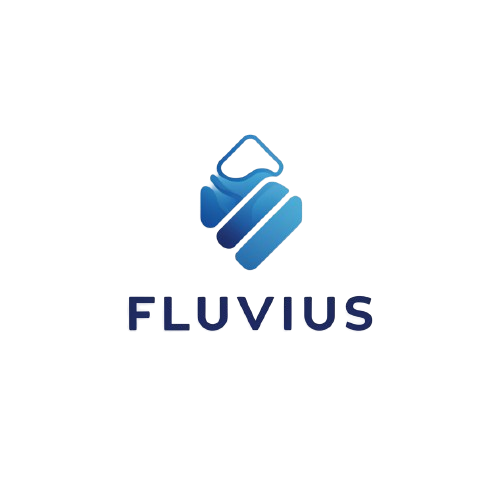

🌊 Sistema de Divulgación y Gestión de los Recursos Hídricos Naturales 🌱

  

🎯 Objetivo General
Desarrollar un sistema integral que promueva el uso responsable de los recursos hídricos naturales, reduciendo el consumo personal de agua y brindando herramientas educativas sobre la crisis ambiental actual. El sistema invita al usuario a tomar parte activa en la solución, explorando prácticas sostenibles.

🎯 Objetivos Específicos
Módulo de Divulgación: Crear un espacio donde los usuarios puedan visualizar artículos, noticias y estudios recientes organizados por categorías temáticas relacionadas con el agua y su conservación.

Calculadora de Huella Hídrica: Implementar una herramienta interactiva que permita calcular la huella hídrica personal mediante un formulario dinámico y recibir recomendaciones personalizadas para reducir el consumo de agua.

Módulo de Capacitación y Soluciones: Proporcionar acceso a cursos y materiales educativos sobre prácticas sostenibles, y ofrecer recomendaciones basadas en la huella hídrica de los usuarios para reducir su impacto ambiental.

😵‍💫 Planteamiento del Problema
La crisis global del agua se ha agravado en los últimos años debido a factores como el cambio climático, los incendios forestales y las actividades humanas que afectan negativamente a los ecosistemas. Uno de los mayores retos es el desconocimiento generalizado sobre la magnitud de la crisis hídrica y las acciones que podrían mitigarla.

📃 Justificación
La crisis ambiental actual representa una amenaza seria para el equilibrio ecológico y la supervivencia humana. Este proyecto tiene como objetivo desarrollar una plataforma que divulgue información relevante y proporcione herramientas prácticas para promover un uso eficiente del agua. Al permitir que los usuarios calculen su huella hídrica y accedan a datos actualizados, esta plataforma ofrece recomendaciones personalizadas que pueden contribuir a la preservación de los recursos hídricos.

🚀 Alcance
Este proyecto busca crear una plataforma integral que optimice la gestión de los recursos hídricos y proporcione soluciones educativas y prácticas ante la crisis del agua. Los módulos incluyen:

Divulgación de Información Actualizada: Artículos y noticias sobre la crisis hídrica y problemas ambientales.
Calculadora de Huella Hídrica: Evaluación personalizada del consumo de agua y sugerencias para reducirlo.
Capacitación en Prácticas Sostenibles: Cursos y materiales educativos que promuevan la adopción de hábitos sostenibles.
⛷️ Integrantes del Equipo
Alicia Valeria Medina Oquendo (Product Owner)
Samuel Felipe Guerrero Hernández (Scrum Master)
Valentina Córdoba Sánchez (Desarrolladora)
